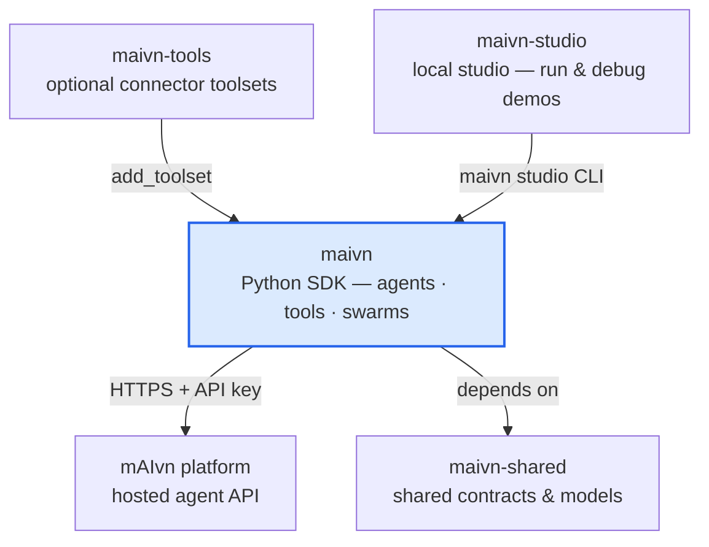

# maivn

Python SDK for building agentic systems with typed tools and dependencies.

The mAIvn SDK provides a clean, declarative interface for creating AI agents with:

- **Typed tool definitions** using decorators and Pydantic models
- **Dependency injection** between tools, agents, and external data
- **Structured outputs** with guaranteed schema conformance
- **Multi-agent orchestration** via Swarms
- **Concurrent batch invocation** for independent Agent and Swarm requests
- **MCP integration** for external tool servers

## Ecosystem

`maivn` is the core SDK in the **mAIvn** developer ecosystem. Learn more at
[maivn.io](https://maivn.io) — or dive into the developer hub at
[developer.maivn.io](https://developer.maivn.io).



## Features

- **Declarative Tools**: Define tools with `@agent.toolify()`, `agent.add_tool(...)`,
  or `Agent(..., tools=[...])` - functions or Pydantic models
- **Dependency Graph**: Chain tools with `@depends_on_tool`, inject secrets with `@depends_on_private_data`
- **Structured Output**: Use `final_tool=True` for guaranteed typed responses
- **Multi-Agent**: Coordinate agents with `Swarm` and `@depends_on_agent`
- **Batch Invocation**: Run multiple independent `invoke()` calls with `batch()` or `abatch()`
- **Scheduled Invocation**: Run any agent or swarm on a `cron(...)`, `every(...)`, or `at(...)` schedule with bounded jitter, retry/backoff, misfire and overlap policies
- **Async Surface**: `ainvoke()` / `astream()` mirror `invoke()` / `stream()` for native asyncio code
- **MCP Support**: Connect external MCP servers (stdio/HTTP) as tool providers
- **Interrupts**: Collect user input mid-execution with `@depends_on_interrupt`
- **System Tools**: Built-in `web_search`, `repl`, `think`

## Requirements

- Python 3.10+

## Installation

```bash
pip install maivn
```

`maivn` depends on the public `maivn-shared` package and will install it automatically
from PyPI.

To install the public Studio companion and enable `maivn studio` from a normal shell:

```bash
pip install maivn maivn-studio
maivn studio
```

With a uv-managed project the command lives in the project `.venv`, which uv does
not auto-activate — use `uv run maivn studio` (or activate the venv first).

`maivn-studio` pins a compatible `maivn` version, so installing them together always resolves a matching pair.

## Quick Start

### Basic Agent with Tools

```python
import os

from maivn import Agent
from maivn.messages import HumanMessage

agent = Agent(
    name='weather_agent',
    description='Provides weather information',
    system_prompt='You are a helpful weather assistant.',
    api_key=os.environ['MAIVN_API_KEY'],
)

@agent.toolify(description='Get current weather for a city')
def get_weather(city: str) -> dict:
    return {'city': city, 'temp': 72, 'condition': 'sunny'}

response = agent.invoke([HumanMessage(content='What is the weather in Austin?')])
print(response.response)
```

`invoke()` returns a `SessionResponse`. Use `response.response` for the final
assistant text and `response.result` for structured or final-tool outputs.

You can also register tools without decorators:

```python
def get_weather(city: str) -> dict:
    """Get current weather for a city."""
    return {'city': city, 'temp': 72, 'condition': 'sunny'}

agent = Agent(
    name='weather_agent',
    description='Provides weather information',
    system_prompt='You are a helpful weather assistant.',
    api_key='your-api-key',
    tools=[get_weather],
)

# Or add tools after construction.
agent.add_tool(get_weather)
```

### Fast Structured Output

Use `.structured_output()` to bypass the orchestrator for faster responses:

```python
from pydantic import BaseModel, Field

class SentimentAnalysis(BaseModel):
    sentiment: str = Field(..., description='positive, negative, or neutral')
    confidence: float = Field(..., ge=0, le=1)

# Fast path - bypasses orchestrator, tools still execute as needed
response = agent.structured_output(SentimentAnalysis).invoke(
    [HumanMessage(content='Analyze: "I love this product!"')]
)
```

### Structured Output with Full Orchestration

Use `final_tool` pattern when you need full orchestration for complex workflows:

```python
from pydantic import BaseModel, Field

@agent.toolify(final_tool=True)
class WeatherReport(BaseModel):
    """Structured weather report."""
    city: str = Field(..., description='City name')
    temperature: int = Field(..., description='Temperature in Fahrenheit')
    summary: str = Field(..., description='Human-readable weather summary')

# Full orchestration for complex workflows
response = agent.invoke(
    [HumanMessage(content='Weather report for Austin')],
    force_final_tool=True,
)
```

### Concurrent Batch Invocation

Use `batch()` when you have multiple independent requests for the same agent or
swarm. The SDK runs the underlying `invoke()` calls concurrently and returns
responses in the same order as the inputs.

```python
batch_inputs = [
    [HumanMessage(content='Summarize ticket A')],
    [HumanMessage(content='Summarize ticket B')],
    [HumanMessage(content='Summarize ticket C')],
]

responses = agent.batch(
    batch_inputs,
    max_concurrency=3,
    force_final_tool=True,
)

# Async variant
responses = await agent.abatch(batch_inputs, max_concurrency=3)
```

### Scheduled Invocation

Run any agent or swarm on a cadence with optional jitter and retry. The
builder mirrors `invoke` / `stream` / `batch` and the async variants:

```python
from datetime import timedelta
from maivn import JitterSpec, Retry

job = agent.cron(
    '0 9 * * MON-FRI',                  # weekdays at 09:00
    tz='America/New_York',
    jitter=JitterSpec.symmetric(timedelta(minutes=10)),  # ±10 min uniform
    retry=Retry(max_attempts=3, backoff='exponential', base=timedelta(seconds=30)),
).invoke([HumanMessage(content='Compose the daily ops briefing.')])

job.on_fire(lambda r: print(f'fired at {r.fired_at}, jitter={r.jitter_offset}'))
job.on_error(lambda r: alert(r.error))

# ... later
job.stop(drain=True)
```

`scope.every(timedelta(minutes=15))` and `scope.at(when)` are also
available. See the [Scheduled Invocation guide](docs/guides/scheduled-invocation.md)
and [Scheduling reference](docs/api/scheduling.md) for the full surface.

### Tool Dependencies

```python
from maivn import depends_on_tool

@agent.toolify(description='Fetch raw sensor data')
def fetch_sensor_data(sensor_id: str) -> dict:
    return {'sensor_id': sensor_id, 'readings': [72, 73, 71]}

@agent.toolify(description='Analyze sensor readings')
@depends_on_tool(fetch_sensor_data, arg_name='sensor_data')
def analyze_readings(sensor_data: dict) -> dict:
    readings = sensor_data['readings']
    return {'average': sum(readings) / len(readings)}
```

### Private Data Injection

```python
from maivn import depends_on_private_data

@agent.toolify(description='Call external API')
@depends_on_private_data(data_key='api_secret', arg_name='secret')
def call_api(query: str, secret: str) -> dict:
    # 'secret' is injected at execution time, never exposed to LLM
    return {'result': f'Called API with query: {query}'}

# Set private data (stays within the runtime)
agent.private_data = {'api_secret': 'sk-xxx'}
```

### Multi-Agent with Swarm

```python
from maivn import Agent, Swarm, depends_on_agent

researcher = Agent(
    name='researcher',
    description='Research specialist',
    system_prompt='You research topics thoroughly.',
    api_key='your-api-key',
)

writer = Agent(
    name='writer',
    description='Content writer',
    system_prompt='You write clear, engaging content.',
    api_key='your-api-key',
    use_as_final_output=True,  # This agent produces final output
    included_nested_synthesis='auto',  # default: orchestrator/runtime decides
)

@researcher.toolify(description='Research a topic')
def research_topic(topic: str) -> dict:
    return {'findings': f'Research findings about {topic}'}

@writer.toolify(description='Write article')
@depends_on_agent(researcher, arg_name='research')
def write_article(research: dict) -> dict:
    return {'article': f'Article based on: {research["findings"]}'}

swarm = Swarm(
    name='content_team',
    agents=[researcher, writer],
)

response = swarm.invoke(
    HumanMessage(content='Write about AI agents'),
    force_final_tool=True,
)
```

## Security

**Your code stays local.** All function tools and MCP tools execute in your environment - code is never transferred to or executed on the mAIvn service.

The mAIvn service only receives tool schemas (names, descriptions, parameters) and orchestrates execution. The actual tool code runs locally in your environment, ensuring:

- Your business logic remains private
- Sensitive data processed by tools stays local
- You have full control over tool access and permissions

## Scalability

**Thousands of tools, no problem.** The mAIvn service provides high-performance tool management for agents and swarms with large tool catalogs. Tool selection and orchestration remain fast and accurate regardless of how many tools you register.

## Core Concepts

| Concept          | Description                                              |
| ---------------- | -------------------------------------------------------- |
| **Agent**        | Container for tools, configuration, and invocation logic |
| **Swarm**        | Coordinates multiple agents with shared tool access      |
| **Tool**         | Function or Pydantic model exposed to the LLM            |
| **Dependency**   | Declares data flow between tools/agents                  |
| **Final Tool**   | Marked tool that produces the structured output          |
| **Private Data** | Secrets injected at execution time within the runtime    |

## Public API

### Core Classes

| Class           | Description                                    |
| --------------- | ---------------------------------------------- |
| `Agent`         | Main agent class with tools and invocation     |
| `Swarm`         | Multi-agent orchestration container            |
| `Client`        | HTTP connection manager (usually auto-created) |
| `ClientBuilder` | Factory for creating Client instances          |
| `BaseScope`     | Base class for Agent/Swarm                     |
| `MCPServer`     | MCP server configuration                       |
| `MCPAutoSetup`  | Auto-setup for uvx-based MCP servers           |
| `ScheduledJob`  | Lifecycle handle returned by `cron/every/at`    |
| `JitterSpec`    | Bounded randomness for scheduled fires          |
| `Retry`         | Retry policy with constant/linear/exp backoff   |
| `RunRecord`     | Outcome of a single scheduled fire              |

### Decorators

| Decorator                                     | Description                         |
| --------------------------------------------- | ----------------------------------- |
| `@agent.toolify()`                            | Register a function/model as a tool |
| `@depends_on_tool(tool, arg)`                 | Inject output from another tool     |
| `@depends_on_agent(agent, arg)`               | Inject output from another agent    |
| `@depends_on_private_data(key, arg)`          | Inject secret at execution time     |
| `@depends_on_interrupt(arg, prompt, handler)` | Collect user input                  |

### Configuration

| Function                                  | Description               |
| ----------------------------------------- | ------------------------- |
| `ConfigurationBuilder.from_environment()` | Load config from env vars |
| `get_configuration()`                     | Get current configuration |
| `MaivnConfiguration`                      | Configuration model       |

### Logging

| Function                      | Description             |
| ----------------------------- | ----------------------- |
| `configure_logging(log_file)` | Initialize SDK logging  |
| `get_logger()`                | Get SDK logger instance |

### Messages

Import from `maivn.messages`:

| Class             | Description                          |
| ----------------- | ------------------------------------ |
| `HumanMessage`    | User input message                   |
| `AIMessage`       | Assistant response                   |
| `SystemMessage`   | System prompt                        |
| `RedactedMessage` | Message with sensitive data redacted |

## Environment Variables

| Variable                        | Description                    | Default  |
| ------------------------------- | ------------------------------ | -------- |
| `MAIVN_API_KEY`                 | API key loaded by env-based setup or your own `os.environ` lookup | None |
| `MAIVN_TIMEOUT`                 | HTTP request timeout (seconds) | 600      |
| `MAIVN_TOOL_EXECUTION_TIMEOUT`  | Per-tool timeout (seconds)     | 900      |
| `MAIVN_DEPENDENCY_WAIT_TIMEOUT` | Dependency resolution timeout  | 300      |
| `MAIVN_TOTAL_EXECUTION_TIMEOUT` | Total session timeout          | 7200     |
| `MAIVN_ENABLE_BACKGROUND_EXECUTION` | Background tool execution | True     |
| `MAIVN_LOG_LEVEL`               | Console log level              | OFF      |
| `MAIVN_DEPLOYMENT_TIMEZONE`     | Server timezone                | UTC      |

`MAIVN_ENABLE_BACKGROUND_EXECUTION` controls whether tool calls are dispatched
via a background thread pool. Set it to `false` to force inline, sequential
execution for more deterministic runs.

## Documentation

The docs read top-down as a spine: start at the **Overview**, learn the **Core
Concepts**, work through the task-focused **Guides**, then reach for the **SDK
Reference** when you need an exact name. New here? Read the three Getting Started
pages in order, then jump to whichever guide matches your task.

### Getting Started

- [Overview](docs/overview.md) - The front door: what MAIVN is, the one mental model, install, and a first agent
- [Quickstart](docs/guides/getting-started.md) - Build a running agent with a tool and a typed answer, step by step
- [Core Concepts](docs/core-concepts.md) - Agents, swarms, tools, dependencies/DAG, sessions, and structured output, in one place

### Guides

- [Tools and Dependencies](docs/guides/tools.md) - Register tools, toolsets, and hooks; chain them into a DAG
- [Dependencies](docs/guides/dependencies.md) - Every dependency and control decorator, in depth
- [Multi-Agent Swarms](docs/guides/multi-agent.md) - Coordinate specialist agents with dependency-aware members
- [Authentication & API Keys](docs/guides/authentication.md) - Authenticate the SDK, key scopes, rejected-key handling, and key hygiene
- [Sessions, Invocation, and Streaming](docs/guides/sessions-and-streaming.md) - `invoke`/`stream`/`ainvoke`/`astream`, results, thread continuity, batch
- [Structured Output](docs/guides/structured-output.md) - Guaranteed typed results via `final_tool` and `structured_output()`
- [Private Data and PII Protection](docs/guides/private-data.md) - Keep secrets and PII out of the model
- [Interrupts & Human-in-the-Loop](docs/guides/interrupts.md) - Pause a turn for human input with `@depends_on_interrupt`, then resume
- [Enrichment Events and Streaming to a Frontend](docs/guides/frontend-events.md) - Live progress phases, the enrichment contract, and streaming events to any frontend
- [Token and Usage Tracking](docs/guides/billing-and-usage.md) - `TokenUsage` per run, plus account usage and plan models
- [System Tools](docs/guides/system-tools.md) - Built-in `web_search`, `repl`, `think`
- [Connecting MCP Servers](docs/guides/mcp.md) - Plug in external MCP tool servers over stdio/HTTP, with auth and the trust boundary
- [Memory and Recall](docs/guides/memory-and-recall.md) - Carry context across turns; skills, resources, and insights
- [Scheduled Invocation](docs/guides/scheduled-invocation.md) - Cron, jitter, retry, lifecycle
- [Timeouts, Retries & Reliability](docs/guides/reliability.md) - Bound slow work and retry only the transient failures worth retrying
- [Testing & Local Development](docs/guides/testing.md) - Compile requests offline, unit-test tools directly, and mock agent responses
- [mAIvn Studio](docs/guides/maivn-studio.md) - Studio UI + API reference

### SDK Reference

- [SDK Reference](docs/api/README.md) - The complete public surface you import from `maivn`, grouped by area
- [Shared Data Models](docs/api/data-models.md) - Typed shapes you read off responses and pass in (`SessionResponse`, `TokenUsage`, privacy and billing models, messages)
- [Agent](docs/api/agent.md) - Agent class reference
- [Swarm](docs/api/swarm.md) - Swarm class reference
- [Client](docs/api/client.md) - Client class reference
- [Decorators](docs/api/decorators.md) - Dependency decorators
- [Configuration](docs/api/configuration.md) - Configuration system
- [MCP](docs/api/mcp.md) - MCP server integration
- [Messages](docs/api/messages.md) - Message types
- [Logging](docs/api/logging.md) - Logging system
- [Scheduling](docs/api/scheduling.md) - `cron/every/at`, jitter, retry, `ScheduledJob`
- [Errors & Exceptions](docs/api/errors.md) - Every error the SDK raises, where to import it, and how to handle each
- [Versioning & Stability](docs/versioning.md) - `__version__`, the `AppEvent` contract version, and which surfaces are stable

### Examples

A working tour of the SDK organized by what you'd want to build. See the
[Examples index](docs/examples/README.md) for the full table of contents.

- [Basics](docs/examples/basics.md) - First agent, tools, final tool, private data, structured types
- [Agents & Tools](docs/examples/agents-and-tools.md) - Tool registration variants, deps, hooks
- [Swarms](docs/examples/swarms.md) - Multi-agent collaboration patterns
- [MCP Integration](docs/examples/mcp.md) - stdio + HTTP + auto-setup
- [Memory](docs/examples/memory.md) - Lifecycle, retrieval, skills, insights, bound resources
- [Private Data](docs/examples/private-data.md) - Placeholders, `RedactedMessage`
- [Batch & Scheduling](docs/examples/batch-and-scheduling.md) - `batch`, `cron`, jitter, retry, overlap
- [Interrupts](docs/examples/interrupts.md) - Human-in-the-loop
- [Real-World Projects](docs/examples/projects.md) - Automobile spec, data harmonization, HTML email, financial planner

### Reference

- [Glossary](docs/glossary.md) - Plain-language A-Z of core concepts and the terms people mix up
- [Troubleshooting](docs/troubleshooting.md) - Common errors and debugging
- [Best Practices](docs/best-practices.md) - Production patterns

## Development

### Setup

```bash
cd libraries/maivn
uv sync
```

### Testing

```bash
uv run pytest
uv run pytest --cov=maivn --cov-report=term-missing
```

Coverage gate: 80% line coverage, excluding terminal reporter UI modules and MCP integration
modules as defined in `pyproject.toml` under `tool.coverage`.

### Linting

```bash
uv run ruff check .
uv run ruff format .
uv run pyright
```

## Releases

- `CI` runs on pull requests and pushes to the default branch (`master` today).
- `Publish PyPI` runs on version tags that match `v*`.
- Configure PyPI Trusted Publishing for this repository before the first release.

For standalone repo verification before `maivn-shared` is published, use a local checkout of
`maivn-shared`. The GitHub Actions workflow injects that temporary `uv` source override
automatically.

## License

See [LICENSE](LICENSE) for details.
